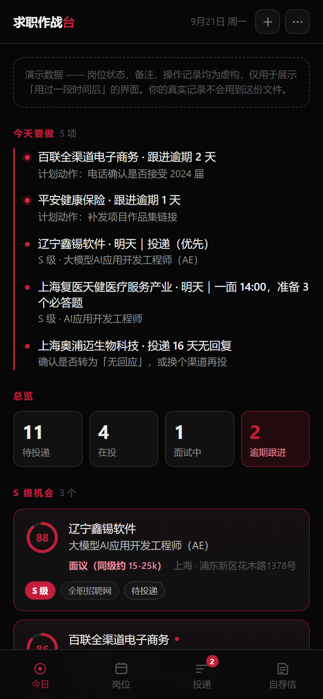
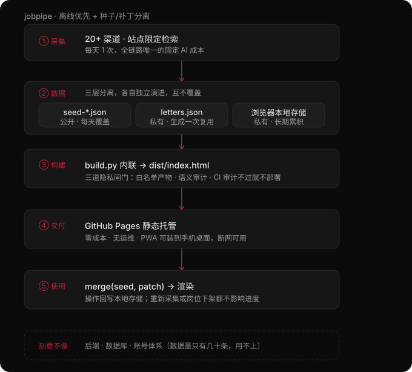

# jobpipe · 投递作战台

**在线使用：<https://ssllf8.github.io/jobpipe/>** —— 手机浏览器打开后「添加到主屏幕」，即为可离线使用的全屏 App。

一个**无服务端**的求职投递管理工具。手机优先，纯黑底 + 单一强调色，离线可用。

> 解决的问题：投了 20 家公司之后，记不住谁回了谁没回、该跟进谁、上一轮面试聊了什么。
> 工具本身要足够轻，不能比求职这件事更费劲。



---

## 它做什么

| 页面 | 内容 |
|---|---|
| **今日** | 打开即见「今天要做」：逾期待跟进、面试倒计时、投递沉默超期、S 级新岗位待投 |
| **岗位** | 按匹配分排序的岗位池，S/A/B/C 分档筛选，点开看「为什么匹配 / 能力缺口 / 投递建议」 |
| **投递** | 8 状态投递管道，逾期项自动浮顶并标红，归档项可恢复 |
| **自荐信** | 只对 S 级岗位准备，一键复制纯文本；正文**离线预生成并缓存**，看板上不调 AI |

记一次投递只要两步：点开岗位 → 点「已投递」。投递日期自动填今天，操作记录自动落一条。

## 核心设计



### 1. 三层数据分离（这是能用得住的前提）

岗位池由采集脚本每天重写，投递进度由你手写，自荐信由 AI 生成一次后长期复用。
这三种数据的生命周期完全不同，混在一起必然互相覆盖：

```
data/seed-*.json        岗位池     构建期内联，只读，每天被采集脚本覆盖
data/letters.json       自荐信     由 tools/gen_letter.py 生成后累积，永不重复调用 AI
localStorage            操作记录   状态 / 备注 / 时间线 / 手动新增（私有）
        │
        │  build.py 内联 merge(seed, letters)
        ▼
dist/*.html             单文件，双击即用，零网络请求
        │
        ▼  merge(内嵌, 本地补丁)   ← 渲染时合并，各写各的，互不覆盖
        页面数据
```

补丁只存**改动过的字段**，按 `id` 匹配。所以：
- 重新采集岗位 → 你的进度不受影响
- 岗位被采集脚本删掉 → 你的记录也不受影响（补丁还在）
- 自荐信若写回 `seed`，第二天采集一跑就没了 → 所以它独立成 `letters.json`

### 2. 自荐信：只在 S 级、只生成一次、离线预生成

自荐信是这套 AI 成本控制的核心落点：

- **只对 S 级（≥78 分）**岗位生成，A/B/C 级根本不进这个流程；
- **生成一次即落盘**，看板上永远是读缓存，不会每次打开都调 API；
- **生成在电脑上跑脚本**，不在网页里调 AI —— 页面上没有密钥，也没有每次点击的费用；
- 提示词里写死了 10 条硬约束（点名项目、给数字、缺口只写一句、禁套话、禁编造），
  并且有测试专门守着这些护栏不被改坏。

模型对「写 450–550 字」这类长度约束执行得并不可靠（实测普遍超出 20%~35%），
所以脚本里加了**程序侧兜底**：正文超过阈值就再让它压一轮，而不是指望模型自觉。

**隐私护栏**：自荐信正文点名了投递的公司（"应聘辽宁鑫锡的……岗位"），属于个人投递行为。
所以可发布的 `index.html` **一律不含自荐信**（按输出文件名自动判定，不依赖你记得加参数），
只有演示版与个人版才内联。

### 3. 内嵌数据只在"本地为空"时采纳

个人版（`--state`）会把你的记录内嵌进 HTML。但如果每次打开都采纳内嵌版本，
**重新部署一次就把手机上的进度回滚了**。所以规则是：

> 只在 localStorage 为空（首次打开 / 换了新设备）时才采纳内嵌数据，之后一切以本地为准。

需要主动拉取时，用「数据与设置 → 载入内嵌数据」。

### 4. 三种构建，产物文件名刻意不同

| 命令 | 产物 | 自荐信 | 用途 |
|---|---|---|---|
| `python build.py` | `dist/index.html` | **不含** | 公开版，不含任何个人数据 |
| `python build.py --demo` | `dist/preview-demo.html` | 含 | 演示版，虚构状态，用于截图与展示 |
| `python build.py --state data/state.json` | `dist/local.html` | 含 | 个人版，内嵌真实记录，**只能本地用** |

`--state` 若试图输出成 `index.html`，构建会**直接拒绝**——防止真实数据被误传到公开地址。

### 5. 分层使用 AI，把成本压到最低

要覆盖尽量多的岗位来源（耗 AI），又不能让 AI 开销失控：

| 环节 | 用 AI？ | 频率 |
|---|---|---|
| 岗位采集 | 用（检索） | 每天 1 次 |
| **匹配打分** | **不用** —— 纯规则关键词算法 | 无限次，零成本 |
| 自荐信生成 | 用 | 仅 S 级（≥78 分），生成后缓存，**永不重复调用** |
| 页面渲染 | 不用 | 纯静态 |

打分环节彻底不调 AI，所以可以随时重跑、随便调参、完全可测。详见 `src/score.py`。

### 6. 打分口径外置

技能词表、方向词表、四维权重、分档阈值全部在 `src/profile.json`。
改匹配口径不需要动代码。

### 7. PWA：可安装、可离线，且不与"单文件"冲突

Service Worker **不能被内联**（浏览器强制要求同源独立文件），所以「单文件 HTML」与
「PWA」不是二选一，而是并存：

```
dist-publish/
├── index.html              自包含，file:// 双击即用，零外链
├── manifest.webmanifest    start_url / scope 全部用 ./ 相对写法
├── sw.js                   预缓存 + 离线兜底
└── icons/                  4 张图标（含 maskable 与 apple-touch-icon）
```

只有可发布的 `index.html` 才带这套附属文件；演示版与个人版不带 ——
否则同一目录下会争抢同一个 SW scope。运行时也用「有没有引用 manifest」
做同一道判断（`initPWA()` 里的守卫），两头对齐。

**三条关键取舍**

| 问题 | 选择 | 理由 |
|---|---|---|
| 导航请求的缓存策略 | **network-first** | 这是每天更新岗位的看板。若走 cache-first，部署新版本后手机永远停在旧数据，用户还察觉不到。宁可多一次网络往返，断网时再回退缓存 |
| 新版本何时接管 | **等用户点「刷新」** | `install` 阶段直接 `skipWaiting()` 会让新缓存配旧页面，表现为「刷新了还是旧数据」。现在装好后弹提示条，用户点了才接管 |
| 缓存版本号 | **产物内容的 sha1 前 10 位** | 用时间戳的话，每次构建（哪怕一字未改）都弹「有新版本」。提示一旦变噪音就会被无视 |

**实测抓到的两个真问题**（都是"装上了却没提示"，靠单元测试发现不了）：

1. **`statechange` 竞态**：新 SW 安装可能快到等 `updatefound` 回调跑起来时状态已是
   `installed`，那个 `statechange` 早错过了。修法是在 `updatefound` 里除了监听还
   **主动查一次**当前状态。诊断数据坐实了这点：`updatefound: 1` 但捕获到的
   `statechange` 事件数为 `0`。
2. **图标里那道红杠和「职」的末横糊在一起**，放大看像脏点 —— 直接删掉，一个字足够。

### 8. 采集：不爬页面，只出清单 + 规则解析

逐个爬招聘站有三重成本：**反爬**（BOSS / 猎聘有登录墙与风控）、**合规**（多数站点服务条款
禁止批量抓取）、**维护**（页面一改版解析就失效）。用一个决定绕开全部三样 ——
脚本**不抓任何页面**，只按各站公开的 URL 规则拼检索链接，剩下的交给浏览器。

```
tools/search_plan.py   20+ 渠道 × 岗位关键词 → 可点检索清单（dist/search-plan.html）
         ↓  你点开、挑岗位、复制 JD
tools/ingest_jd.py     正则解析 + 复用 score.py 打分 → 合并进新的 seed
         ↓
build.py               自动取 data/ 里最新一份 seed 内联
```

- **零反爬风险**：只生成 URL，浏览器里看到的和真人自己搜的完全一致
- **零 AI 成本**：解析七八个字段用正则足够，结果还确定可测。AI 留给自荐信那一环
- **零维护**：站点改版最多让某条链接失效，不会让整条链路崩掉
- **认不出就留空**：缺哪个字段会在报告里点名，宁可空着也不猜 ——
  猜错的公司名会污染之后积累的所有投递记录

「20+ 渠道」不是口号，有测试守着：`tools/channels.json` 少于 20 条会直接测试失败，
免得日后为了省事把渠道悄悄砍掉。

### 9. 每天怎么用：一个桌面快捷方式

日常动作只有三步——挑岗位、贴 JD、上线。第三步全自动，于是把整条链路收进一个脚本，
桌面上双击就跑：

```
tools/daily.py
  ① search_plan.py --open      生成今日检索清单并直接在浏览器里打开
  ② build.py --publish          本地先过一遍构建 + 发布闸门
     check_public.py            有问题就停在这里，不推上去让 CI 变红
  ③ git add/commit/push         CI 自动测试 → 审计 → 上线（约 1 分钟）
  ④ 打印今天的下一步操作
```

- **先自检再推**：② 不过就直接中断，线上保持上一版可用状态 ——
  宁可今天不更新，也不要把一个打不开的站点推上去
- **无变更不空提交**：`git diff --cached --quiet` 判断，没有变化就跳过提交
- **不落盘存凭据**：从 Git Credential Manager 读出 token，用 `http.extraheader`
  随请求带走。之前用临时凭据文件踩过坑 —— 它依赖 `$HOME` 正常，环境一异常就
  **静默失败并挂起等人输密码**，所以这里额外带 `GIT_TERMINAL_PROMPT=0`
- **双击场景要看得见报错**：脚本在终端里跑完不关窗（`sys.stdin.isatty()` 时等一次回车），
  而管道 / CI 里跑就完全不拦

再配个桌面快捷方式：

```bash
python tools/make_shortcut.py          # 桌面生成「每日求职推送」快捷方式
python tools/make_shortcut.py --remove # 不要了就删掉
```

`make_shortcut.py` 顺带把 PWA 图标 `src/icons/icon-192.png` 包成 `assets/jobpipe.ico`
—— ICO 从 Vista 起允许直接内嵌 PNG，所以不需要 Pillow 之类的绘图库，纯 `struct` 拼个头就行。
建快捷方式走 PowerShell 的 `-EncodedCommand`（UTF-16LE base64），不拼命令行字符串，
中文路径和空格都不会被转义搞坏；建完还会**读回来核对** Target / Arguments。

## 快速开始

```bash
# 每日一键：检索清单 → 自检 → 推送上线（桌面快捷方式跑的就是这个）
python tools/daily.py
python tools/daily.py --no-push    # 只本地生成，不推远端
python tools/daily.py --no-open    # 不自动打开浏览器

# 桌面快捷方式 + 图标
python tools/make_shortcut.py

# 公开版产物 → dist/index.html（含 PWA 附属文件）
python build.py

# 演示版（虚构状态，看界面用）→ dist/preview-demo.html
python build.py --demo

# 个人版（内嵌你导出的记录）→ dist/local.html
python build.py --state data/state.json

# 可发布版本 → dist-publish/（先清空再只产出 index.html + PWA 资产，CI 用）
python build.py --publish

# 发布闸门：确认产物里没有个人数据（本地跑一次就不必等 CI 报错）
python tools/check_public.py

# 采集 ① 生成检索清单：20+ 渠道 × 岗位关键词的可点链接 → dist/search-plan.html
python tools/search_plan.py
python tools/search_plan.py --open                                # 生成后自动打开
python tools/search_plan.py --keywords "AI应用开发,大模型应用"      # 临时换关键词
python tools/search_plan.py --engine baidu                        # 换搜索引擎做限定检索

# 采集 ② 把挑中的岗位 JD 贴回来看板（规则解析，零 AI 调用）
python tools/ingest_jd.py --list-channels                         # 先看渠道名怎么拼
python tools/ingest_jd.py --file jd.txt --channel 猎聘 \
    --company "某某科技有限公司" --title "AI应用开发工程师" --url "https://…"
python tools/ingest_jd.py --file jd.txt --dry-run                 # 只看解析结果，不写文件
python tools/ingest_jd.py --text "…" --company X --title Y        # 直接贴一段

# 生成 PWA 图标（改了图标设计才需要；产物不依赖 Playwright）
python tools/make_icons.py --preview

# 自荐信：先看还缺哪些，再给 S 级岗位写（结果写进 data/letters.json）
python tools/gen_letter.py --list
python tools/gen_letter.py                 # 只补没生成的
python tools/gen_letter.py --dry-run       # 只预览提示词，一次 API 都不调
python tools/gen_letter.py --job <id> --force   # 重做某一个
python tools/gen_letter.py --show <id>     # 在终端里读某封

# 看打分口径校准情况（人工分 vs 算法分）
python src/score.py --data data/seed-2026-09-17.json --profile src/profile.json --calibrate

# 单元测试
python -m pytest

# 端到端行为验证（真实点击 + 刷新 + 持久化，file:// 和 http:// 各跑一遍）
python tools/e2e.py

# PWA 端到端验证（真注册 SW + 断网打开 + 升级提示链路）
python tools/e2e_pwa.py
```

自荐信需要 `DeepSeek` 的 key：在 `04-job-board-app/.env` 里写一行
`DEEPSEEK_API_KEY=sk-xxxx`（该文件已在 `.gitignore` 中）。生成后再跑一次 `python build.py --demo`
就能在看板上看到。

产物双击即可打开。手机上：把 `dist/local.html` 发给自己用浏览器打开，
或者部署 `index.html` 后在手机浏览器里打开，「添加到主屏幕」即为全屏 App，且断网可用。

## 部署

推送到 `main` 即自动部署到 GitHub Pages（`.github/workflows/deploy.yml`）：

```
单元测试 → build.py --publish → check_public.py → upload-pages-artifact → deploy-pages
```

- PR 只跑测试与审计，**不部署**（避免预览分支污染正式地址）
- `check_public.py` 是唯一会挡住部署的检查，所以做成独立可执行脚本而不是测试断言
- 同时只保留一个部署在跑，队列里旧的会被取消

Pages 已启用（Source = **GitHub Actions**），线上地址：<https://ssllf8.github.io/jobpipe/>
若换新仓库，需先在 Settings → Pages 里把 Source 设为 GitHub Actions，**再**推代码——否则第一次 `deploy-pages` 会因 Pages 未启用而失败。

## 数据备份与迁移

看板内「数据与设置」（顶栏 `⋯`）提供：

- **复制数据 / 下载文件** —— 导出成 `state.json`
- **从文件 / 剪贴板导入** —— **合并**而非覆盖，多设备之间来回同步不会互相清空
- **载入内嵌数据** —— 拉取构建期内嵌的那一份
- **清空本地记录** —— 清空前自动留一份备份

导出的 JSON 丢回项目 `data/state.json`，再跑 `python build.py` 就能构建出带数据的个人版留档，
顺带获得 Git 的版本历史。

## 目录结构

```
├── src/
│   ├── index.html      模板（含 7 个构建期占位符）
│   ├── style.css       EPFL 黑红 tokens
│   ├── store.js        存储层：种子/补丁合并、状态机、导入导出（无 DOM 依赖）
│   ├── app.js          视图与交互，原生 JS 无框架；含 PWA 注册与升级提示
│   ├── sw.js           Service Worker：预缓存 + network-first 导航 + 版本化缓存
│   ├── manifest.webmanifest  PWA 清单（start_url / scope 全用相对路径）
│   ├── icons/          4 张图标 PNG（由 tools/make_icons.py 生成，随仓库提交）
│   ├── score.py        纯规则匹配打分（零 AI）
│   ├── seed_store.py   种子定位：取 data/ 里最新的 seed-YYYY-MM-DD.json
│   └── profile.json    技能画像与权重（打分口径的唯一来源）
├── data/
│   ├── seed-2026-09-17.json   初始岗位池：17 个真实在招岗位（人工核实）
│   ├── seed-YYYY-MM-DD.json   采集产出的新岗位池（ingest_jd.py 写，构建自动取最新一份）
│   ├── search-plan-*.md       检索清单纯文本版（可点的 HTML 版在 dist/）
│   ├── letters.json           自荐信缓存，按 job_id 索引（由 gen_letter.py 写）
│   ├── demo-state.json        虚构演示状态，仅供 --demo
│   └── state.json             你的导出存档（已 gitignore）
├── build.py            内联构建，含个人数据防误发布护栏 + PWA 资产产出
├── assets/
│   └── jobpipe.ico     桌面快捷方式图标（make_shortcut.py 由 PWA 图标转出）
├── tools/
│   ├── channels.json   20+ 渠道清单（名称 / 类别 / 域名 / 站内搜索 URL）
│   ├── daily.py        每日一键：检索清单 → 本地自检 → 提交推送 → 下一步提示
│   ├── make_shortcut.py 生成桌面快捷方式（顺带把 PWA 图标包成 .ico）
│   ├── search_plan.py  采集①：展开「关键词 × 城市 × 渠道」→ 可点检索清单
│   ├── ingest_jd.py    采集②：JD 文本 → 规则解析 + 打分 → 合并进新 seed
│   ├── gen_letter.py   自荐信生成：简历 + 岗位 → DeepSeek → letters.json
│   ├── make_icons.py   用 Playwright 渲染 SVG → PNG 图标（不引入绘图库依赖）
│   ├── check_public.py 发布闸门：审计产物不含个人数据、PWA 资产齐备
│   ├── prompts/        提示词模板（写作约束外置，改文风不用改代码）
│   ├── screenshot.py   Playwright 真机尺寸截图 + console 报错检查
│   ├── e2e.py          Playwright 端到端行为验证（点击→存储→刷新→仍在）
│   └── e2e_pwa.py      Playwright PWA 验证（注册→离线→升级提示）
├── .github/workflows/deploy.yml   测试 → 构建 → 审计 → 部署 Pages
└── tests/              157 项测试（conftest.py 把种子钉在初始那份，采集不干扰测试）
```

## 测试

```bash
python -m pytest       # 157 passed
python tools/e2e.py    # 2 环境 × 26 项断言
python tools/e2e_pwa.py  # 25 项断言
```

单元测试分八层：

- **数据层** —— id 唯一、字段完整、状态与分档合法、每个岗位都有可解释的匹配理由
- **算法层** —— 打分确定性、值域、维度权重不越界、薪资解析、人工 S 级不被算法筛掉、
  人工 C 级不被算法捧成 S 级、算法分与人工分的平均绝对偏差在阈值内
- **构建层** —— 占位符全部替换、产物**无外部域引用**、内联 JSON 合法、公开产物不含个人数据、
  个人版拒绝输出成 `index.html`
- **状态层** —— 导入的 JSON 不可信，坏字段必须被丢弃而不是让页面崩掉；演示状态引用的岗位必须真实存在
- **自荐信层** —— 提示词护栏条款仍在、占位符全部填充、`letters.json` 坏结构被跳过、
  只挑 S 级且跳过已生成、**真实自荐信不得泄漏进公开产物**（回归防线）
- **PWA 层** —— manifest 字段与路径、图标声明尺寸**与 PNG 实际像素逐一对齐**、
  SW 处理器齐全、不在 `install` 阶段抢跑、导航走 network-first、
  只有可发布产物带 PWA 资产、版本号随内容变、发布闸门各类泄漏都能拦下
- **采集层** —— 渠道清单必须 ≥20 条且有类别、无域名的渠道不能生成 `site:` 空查询、
  链接全部 URL 编码、清单页零外链零请求、JD 解析（薪资 / 门槛 / 学历 / 地点 / 链接 / 公司**全称**）、
  认不出的字段留空而不是瞎猜、重复岗位被拦下、生成的匹配理由真的取自打分明细
- **日常流程层** —— ICO 头与内嵌 PNG 的结构、PowerShell 引号转义、**取不到凭据时必须直接失败
  而不是落到交互式等密码**、推送输出不得回显 token、`--no-push` 不 stage 任何改动且不留垃圾文件

`tools/e2e.py` 是 M2 加的关键一环。它驱动真实浏览器做完整流程，核心断言只有一条：

> **点完状态 → 刷新页面 → 数据还在吗。**

这条链路构建测试是发现不了的。为什么 file:// 和 http:// 要分别跑：这两个环境下
localStorage 的行为不同，不能想当然（实测两者都可用，但这是测出来的，不是假设的）。

`tools/e2e_pwa.py` 是 M4 加的一环，核心断言是另外两条构建测试同样发现不了的：

> **断网后整页还能打开吗。** 注册成功 ≠ 有可用缓存 ≠ 断网能渲染，这三件事要分开验。
> **升级提示真的会弹、点了真的换版本吗。** 这条最难，实际抓到了 `statechange` 竞态。

`screenshot.py` 用 Playwright 打开产物，检查 console 报错并截图 ——
因为"构建通过"不等于"页面能跑"（M1 的详情面板关不掉、M2 的归档后彻底消失，都是这么发现的）。

## 隐私

仓库公开，但投递记录含公司名、薪资、面试情况，属个人隐私：

- 公开仓库只放代码与种子数据
- 真实数据存在浏览器 localStorage，导出后自行留存
- 自荐信正文点名了投递的公司，因此**不进可发布的 `index.html`**
- `data/state.json`、`data/letters.json`、`data/exports/`、`.env`、`dist/`、`dist-publish/` 均在 `.gitignore` 中
- `--publish` **从不读取本地 state**（否则本机一旦有 `data/state.json`，
  一条发布命令就会自己把个人数据塞进去 —— 靠"记得别加 `--state`"防这种事不可靠）
- 内嵌个人数据的产物物理隔离在 `local.html`，构建脚本还有一道拒绝护栏

**发布闸门**（`tools/check_public.py`，CI 里会挡住部署）逐项检查：

1. 目录里只允许白名单文件 —— `preview-demo.html` / `local.html` 混进来立刻失败
2. 内联数据的 `cover_letter` 必须全空、`state_inlined` 必须为 false、`state_source` 不得是 `file:`
3. 不得出现 API key、疑似本机绝对路径
4. manifest 路径必须相对、图标必须真实存在、`sw.js` 版本号必须已替换

> 注：自荐信本身不含隐私信息（它是要发给 HR 看的），排除它是为了不暴露"在投哪些公司"。

## 路线图

- [x] **M1** 数据模型 + 打分引擎 + 构建脚本 + 手机端只读渲染
- [x] **M2** 状态流转 + 跟进计划 + 备注与时间线 + 手动新增 + 导入导出
- [x] **M3** 自荐信生成（DeepSeek）+ 缓存 + 一键复制 + 公开产物排除
- [x] **M4** PWA（可安装 + 离线 + 版本化缓存 + 升级提示）+ CI + Pages 部署 + 发布闸门
- [x] **M5** 架构图（`docs/architecture.svg`）+ 岗位采集（检索清单 + JD 规则录入）
- [x] **M6** 每日一键流程（`tools/daily.py`）+ 桌面快捷方式（`tools/make_shortcut.py`）

## 说明

- 岗位数据来自公开招聘信息，人工核实后录入，薪资以招聘方公示口径为准。
- 本项目是**完整可运行的开源实现**，非生产级系统；所有数据为个人求职用途。
- 匹配分为规则算法的**初筛信号**，人工判定的分档优先于算法分。
- 自荐信由 AI 起草、人工确认后使用；提示词明确要求所有事实可在简历中找到出处。
